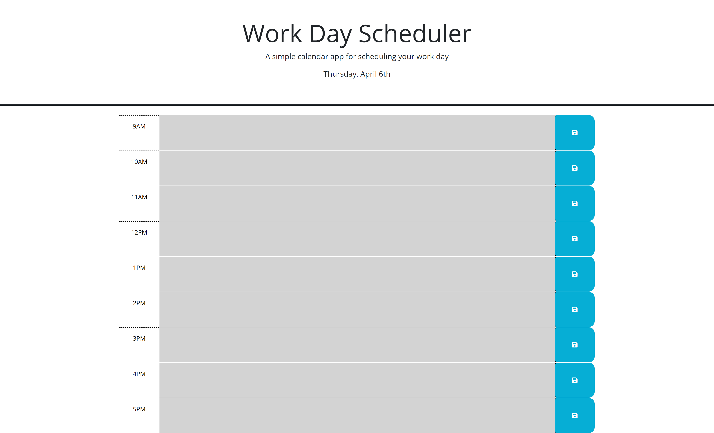

# Scheduler

## Libraries

- This app utilizes the jQuery library

## Overview

This app allows a user to add and save events from 9AM til 5PM. This is a small file structure so I will quickly go through the files and it's functionalities

### Date.js

The `date.js` file has three arrays the `daysOfWeek` array which holds all of the named days of the week such as `Sunday` or `Monday`. `months` which holds all of the named months. `workHours` that holds all of the hours that will be shown on the Scheduler `9AM`, `10AM` ect. It also has a variable `currentDate` which takes the current date and displays it in the expected form

### Scheduler.js

The `Scheduler.js` contains a class that has a static method `timeBlock`. It creates a `timeBlockProxy` object where if we use the .render prop it will return render as a function and appends the element to the DOM. There could be an easier way to do this but I just wanted to keep practicing proxies.

### script.js

The `script.js` puts all the logic together to set the current date at the top, render the necessary time blocks and save the events to the time blocks via localStorage

### The look fo the app

